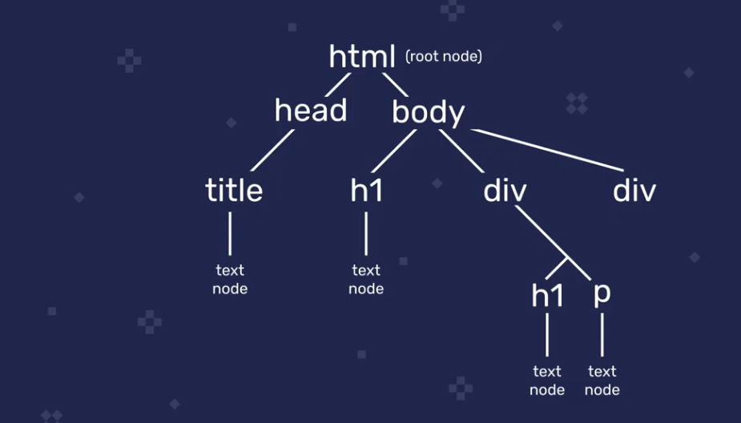

# Aula 01

## Aula 01-01 - Correção dos exercícios da aula anterior

## Aula 01-02 - Observações sobre as duas próximas aulas

## Aula 01-03 - 3 escopos em JavaScript que você deve conhecer

- Essa aula aborda
  1. Escopo de **funções**
  2. Escopo de **blocos**
  3. Escopo **léxico**
- Mas o que é escopo?
  - é a visibilidade de uma variável, onde podemos acessar nossas variáveis
- Escopo de funções
  - Funções têm escopo local dentro da sua definição e as variáveis definidas dentro de funções só estão disponíveis nesse escopo
  - Isso vale pra `let`, `const` e `var`
- Escopo de bloco
  - Funciona de maneira similar ao escopo de funções: blocos de código (delimitados por `{}`) têm escopo local para `const` e `let`, mas *não* para `var`
- Escopo léxico
  - Em funções aninhadas, o escopo da função mais externa está disponível para a função mais interna
  
  ```javascript
  const external = () => {
      const greet = 'Oi'

      const internal = () => {
          const message = `${greet}. Seu pai tem boi?` // greet está disponível no escopo da função internal apesar de ter sido declarada na função external
          console.log(message)
      }

      internal()
  }
  ```
    - Além disso, as regras de escopo se mantém, o que significa que só temos acesso à função `internal` dentro da função `external`
    - De maneira resumida, escopo léxico é o fato de funções aninhadas estarem sujeitas a buscarem variáveis no escopo acimas elas
    - Essa relação é de mão única: funções aninhadas não conseguem acessar o escopo abaixo de seu próprio escopo
    - A acesso ao escopo acima só se dá quando a variável não está presente no atual escopo do função
    - O acesso a níveis superiores se dá independente da quantidade de níveis existente:
      - Caso existam 3 funções aninhadas e tentamos acessar uma variável na função mais interna, o JS primeiro busca a variável no escopo da função intermediária e se também não encontrar busca a variável na função mais externa. Isso pode rolar pra quantos níveis de aninhamento nós tivermos.

## Aula 01-04 - Mozilla Developer Network

- O Mozilla Developer Network (MDN) abriga documentação do JS e é excelente para tirar dúvidas pontuais sobre a linguagem. 
- O Roger dá suas dicas sobre a utilização do MDN:
  - A busca do próprio site nem sempre funciona bem, usar um buscador com os 'mdn' e o que queremos saber costuma ser mais eficiente
  - As páginas em inglês costumam ser mais completas que as em português

## Aula 01-05 - Interagindo com o browser

- Podemos usar JS para interagir com o browser/pagina web para
  - Adicionar conteúdo
  - Modificar estilos CSS
  - Reagir a eventos
  - Criar interações menos discretas, como criar pop-ups
- O JS foi criado justamente para fazer as páginas mais interativas
- Tudo que fazemos para interagir com o browser passa pelo Documento Object Model (DOM)
- Vamos também adicionar, modificar e remover conteúdo
  - adicionar eventos e pop ups

## Aula 01-06 - O que é o DOM - Document Object Model

- O DOM é criado pelo browser, não faz parte de JS em si
- Quando HTML é carregado no browser, o browser cria um objeto que modela esse documento que se chama `document`
- `document` possui várias propriedades e métodos que tornam a interação e manipulação possível
- Quando visualizamos o `document` no console, vemos que ele exibe uma representação visual do html da página
- Além dessa representação, `document` possui os métodos e propriedades que possibilitam a interação entre nosso código js e a página
- O DOM descreve a página html com uma estrutura de árvore hierárquica de nós com o nós mais abrangente sendo o `html`, também conhecido como *root node*
- A hierarquia vai avançando até atingir os elementos mais específicos que são os text nodes



- Programaticamente, o documento HTML é modelado no objeto `document` criado pelo browser quando o HTML é carregado. Utilizamos esse objeto para interagir com a página, usamos suas propriedades e métodos.

## Aula 01-07 Query selector & query selector all

- Quando trabalhamos com o DOM e adicionamos, removemos ou modificamos alguma coisa seguimos alguns passos
- Iniciamos decidindo qual elemento da página vamos manipular para então buscar a referência desse elemento no DOM
- Essa busca se chama querying
- Tendo feito isso vamos pra manipulação de fato
- Essa aula trata das queries
- Os métodos mais recomendados para fazer queries no DOM são `document.querySelector()` e `document.querySelectorAll()` 
- Esses métodos recebem strings de seletores de CSS
- Esses seletores podem ser os elementos de maneira geral (como `h1`, `p`, etc) que são chamados de seletores de tipo, ou seletoresmais específicos como classes ou ids
- Podemos combinar os dois tipos de seletores css (eg, posso selecionar uma `div` que tenha a classe 'error' com a seguinte string:`div.error`)
- Uma outra forma de obter a string para selecionar um elemento específico é abrindo a página, clicando com o botão direito noelemento que queremos selecionar, escolhendo "inspecionar", clicando com o botão direito no elemento HTML que aparece no console dodev tools, clicando em copy e então clicando em "CSS Selector"
- Para obtermos todos os elementos de um determinado tipo, como todos os elementos `p`, usamos `document.querySelectorAll('p')`
- Esse método retorna uma NodeList com as referências para todos os `p` da página
- NodeList é similar a um array mas não é de fato um array, o que significa que nem todos os métodos de array funcionam em NodeLists
- A notação de colchetes para selecionar um elemento específico funciona em NodeLists, assim como .`forEach`
- Para obtermos todos os elementos da página que contém a classe "error", usamos `document.querySelectorAll('.error')`
- Apesar de serem as formas mais eficientes de selecionar elementos do DOM, `document.querySelector` e `document.querySelectorAll()` não são as únicas formas de realizar esse tipo de seleção

## Aula 01-08 - Outras maneiras de fazer queries no DOM

- Também podemos obter a referência de elementos do DOM através do **ID**, do **nome da classe** ou através do **nome da tag**
- Obter um elemento através do seu ID:

```javascript
const title = document.getElementById('title')
```

- Obter um elemento através da sua classe:

```javascript
const errors = document.getElementByClassName('error') // como o metodo eh para classes, nao precisa colocar o ponto antes do nome
```
  - O método acima retorna um html collection, que é tipo um nodelist. Html collections aceitam a notação de colchete para selectionar elementos específicos mas não `.forEach`
- Obter um elemento através do nome da tag:

```javascript
const paragraphs = document.getElementsByTagName('p') // resulta em um html collection com todas as tags p da pagina
```

- Esses métodos tem seus usos mas também têm suas limitações que vem do fato deles retornarem html collections. A impossibilidade (sem antes converter as html collections) de utilizar forEach é uma delas.