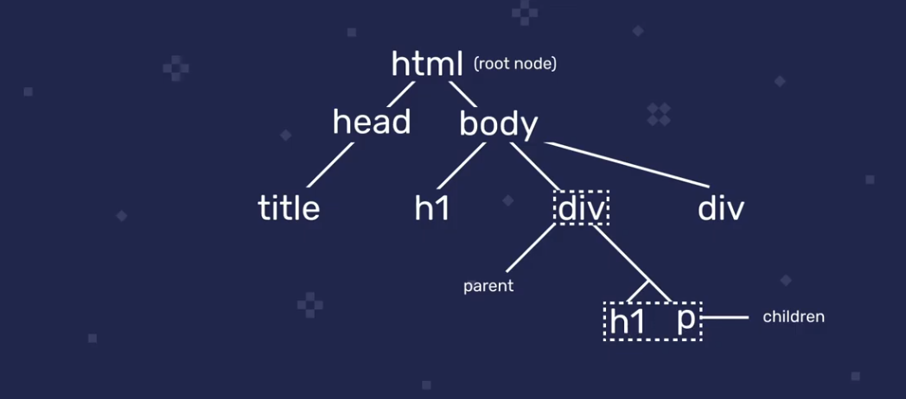

# Aula 01

## Aula 01-01 - Correção dos exercícios da aula anterior

## Aula 01-02 - Observações sobre as duas próximas aulas

## Aula 01-03 - 3 escopos em JavaScript que você deve conhecer

- Essa aula aborda
  1. Escopo de **funções**
  2. Escopo de **blocos**
  3. Escopo **léxico**
- Mas o que é escopo?
  - é a visibilidade de uma variável, onde podemos acessar nossas variáveis
- Escopo de funções
  - Funções têm escopo local dentro da sua definição e as variáveis definidas dentro de funções só estão disponíveis nesse escopo
  - Isso vale pra `let`, `const` e `var`
- Escopo de bloco
  - Funciona de maneira similar ao escopo de funções: blocos de código (delimitados por `{}`) têm escopo local para `const` e `let`, mas *não* para `var`
- Escopo léxico
  - Em funções aninhadas, o escopo da função mais externa está disponível para a função mais interna
  
  ```javascript
  const external = () => {
      const greet = 'Oi'

      const internal = () => {
          const message = `${greet}. Seu pai tem boi?` // greet está disponível no escopo da função internal apesar de ter sido declarada na função external
          console.log(message)
      }

      internal()
  }
  ```
    - Além disso, as regras de escopo se mantém, o que significa que só temos acesso à função `internal` dentro da função `external`
    - De maneira resumida, escopo léxico é o fato de funções aninhadas estarem sujeitas a buscarem variáveis no escopo acimas elas
    - Essa relação é de mão única: funções aninhadas não conseguem acessar o escopo abaixo de seu próprio escopo
    - A acesso ao escopo acima só se dá quando a variável não está presente no atual escopo do função
    - O acesso a níveis superiores se dá independente da quantidade de níveis existente:
      - Caso existam 3 funções aninhadas e tentamos acessar uma variável na função mais interna, o JS primeiro busca a variável no escopo da função intermediária e se também não encontrar busca a variável na função mais externa. Isso pode rolar pra quantos níveis de aninhamento nós tivermos.

## Aula 01-04 - Mozilla Developer Network

- O Mozilla Developer Network (MDN) abriga documentação do JS e é excelente para tirar dúvidas pontuais sobre a linguagem. 
- O Roger dá suas dicas sobre a utilização do MDN:
  - A busca do próprio site nem sempre funciona bem, usar um buscador com os 'mdn' e o que queremos saber costuma ser mais eficiente
  - As páginas em inglês costumam ser mais completas que as em português

## Aula 01-05 - Interagindo com o browser

- Podemos usar JS para interagir com o browser/pagina web para
  - Adicionar conteúdo
  - Modificar estilos CSS
  - Reagir a eventos
  - Criar interações menos discretas, como criar pop-ups
- O JS foi criado justamente para fazer as páginas mais interativas
- Tudo que fazemos para interagir com o browser passa pelo Documento Object Model (DOM)
- Vamos também adicionar, modificar e remover conteúdo
  - adicionar eventos e pop ups

## Aula 01-06 - O que é o DOM - Document Object Model

- O DOM é criado pelo browser, não faz parte de JS em si
- Quando HTML é carregado no browser, o browser cria um objeto que modela esse documento que se chama `document`
- `document` possui várias propriedades e métodos que tornam a interação e manipulação possível
- Quando visualizamos o `document` no console, vemos que ele exibe uma representação visual do html da página
- Além dessa representação, `document` possui os métodos e propriedades que possibilitam a interação entre nosso código js e a página
- O DOM descreve a página html com uma estrutura de árvore hierárquica de nós com o nós mais abrangente sendo o `html`, também conhecido como *root node*
- A hierarquia vai avançando até atingir os elementos mais específicos que são os text nodes


- Programaticamente, o documento HTML é modelado no objeto `document` criado pelo browser quando o HTML é carregado. Utilizamos esse objeto para interagir com a página, usamos suas propriedades e métodos.

## Aula 01-07 Query selector & query selector all

- Quando trabalhamos com o DOM e adicionamos, removemos ou modificamos alguma coisa seguimos alguns passos
- Iniciamos decidindo qual elemento da página vamos manipular para então buscar a referência desse elemento no DOM
- Essa busca se chama querying
- Tendo feito isso vamos pra manipulação de fato
- Essa aula trata das queries
- Os métodos mais recomendados para fazer queries no DOM são `document.querySelector()` e `document.querySelectorAll()` 
- Esses métodos recebem strings de seletores de CSS
- Esses seletores podem ser os elementos de maneira geral (como `h1`, `p`, etc) que são chamados de seletores de tipo, ou seletoresmais específicos como classes ou ids
- Podemos combinar os dois tipos de seletores css (eg, posso selecionar uma `div` que tenha a classe 'error' com a seguinte string:`div.error`)
- Uma outra forma de obter a string para selecionar um elemento específico é abrindo a página, clicando com o botão direito noelemento que queremos selecionar, escolhendo "inspecionar", clicando com o botão direito no elemento HTML que aparece no console dodev tools, clicando em copy e então clicando em "CSS Selector"
- Para obtermos todos os elementos de um determinado tipo, como todos os elementos `p`, usamos `document.querySelectorAll('p')`
- Esse método retorna uma NodeList com as referências para todos os `p` da página
- NodeList é similar a um array mas não é de fato um array, o que significa que nem todos os métodos de array funcionam em NodeLists
- A notação de colchetes para selecionar um elemento específico funciona em NodeLists, assim como .`forEach`
- Para obtermos todos os elementos da página que contém a classe "error", usamos `document.querySelectorAll('.error')`
- Apesar de serem as formas mais eficientes de selecionar elementos do DOM, `document.querySelector` e `document.querySelectorAll()` não são as únicas formas de realizar esse tipo de seleção

## Aula 01-08 - Outras maneiras de fazer queries no DOM

- Também podemos obter a referência de elementos do DOM através do **ID**, do **nome da classe** ou através do **nome da tag**
- Obter um elemento através do seu ID:

```javascript
const title = document.getElementById('title')
```

- Obter um elemento através da sua classe:

```javascript
const errors = document.getElementByClassName('error') // como o metodo eh para classes, nao precisa colocar o ponto antes do nome
```
  - O método acima retorna um html collection, que é tipo um nodelist. Html collections aceitam a notação de colchete para selectionar elementos específicos mas não `.forEach`
- Obter um elemento através do nome da tag:

```javascript
const paragraphs = document.getElementsByTagName('p') // resulta em um html collection com todas as tags p da pagina
```

- Esses métodos tem seus usos mas também têm suas limitações que vem do fato deles retornarem html collections. A impossibilidade (sem antes converter as html collections) de utilizar forEach é uma delas.

# Aula 02

## Aula 02-01 - Correção dos exercícios da aula anterior

## Aula 02-02 - Adicionando e modificando conteúdo em uma página

- Como manipular elementos do DOM?
- Manipulando o *texto* de elementos do DOM
  - A propriedade `document.innerText` determina o texto dos elementos do DOM
  - Portanto, podemos realizar modificações no texto através de modificações no valor dessa propriedade
  - Essas modificações podem ser feitas em dois passos simples:
    1. Selecionamos o elemento que queremos modificar usando `document.querySelector`
    2. Modificamos o valor da propriedade `innerText` usando JS (eg fazendo uma reatribuição, concatenação ou qualquer outra operação aceita em JS)

  ```javascript
  const paragraph = document.querySelector('p')

  paragraph.innerText = 'Estou mudando o texto'
  ```
  - O processo é parecido para realizar modificações em múltiplos elementos:
    1. Selecionamos os elementos que queremos modificar usando `document.querySelectorAll`
    2. Modificamos o valor das propriedades `innerText` usando JS (como `querySelectorAll` retorna uma nodeList podemos usar forEach para facilitar as modificações)

  ```javascript
  const paragraphs = document.querySelectorAll('p')

  log

  paragraphs.forEach((paragraph, index) => {
      paragraph.innerText += `novo texto ${index + 1}`
  })
  ```

  - Manipulando o HTML de elementos do DOM
    - A propriedade `innerHTML` contém o código HTML (inclusive os espaços e identações) dos elementos do DOM
    - Então podemos modificar o HTML através dessa propriedade assim como fizemos com `innerText`
    - Esse método funciona inclusive com propriedades que não possuem conteúdo
    - Caso já exista HTML no elemento que estamos modificando, esse HTML será sobrescrito. Caso não haja HTML, o HTML que passarmos pro elemento será adicionado ao elemento
    - Podemos **acrescentar** HTML usando concatenações ou addition assignments
  
  ```javascript
  const div = document.querySelector('.content')

  const people = ['Jonatan', 'Vinicius', 'Diego']

  people.forEach(person => {
      div.innerHTML += `<p>${person}</p>`
  })
  ```
- Tanto `innerText` quanto `innerHTML` são getters e setters: podemos usá-las para obter (get) valores e setar (set) valores

## Aula 02-03 - Obtendo e setando atributos

- Também podemos obter e modificar atributos e elementos HTML
- Para obter os atributos de um determinado elemento, primeiro selecionamos os elemento usando `querySelector` (ou `querySelectorAll`) e depois encadeamos `getAttribute`, que recebe uma string com o nome do atributo que queremos obter

```javascript
const link = document.querySelector('a')

link.getAttribute('href');
```
- Para setar atributos, usamos `setAttribute` que recebe dois argumentos: o nome do atributo que queremos modificar e o valor que queremos inserir nesse atributo

```javascript
const link = document.querySelector('a')

link.setAttribute('href', 'https://www.rogermelo.com.br')
```
- Modificar atributos é útil em casos como quando o usuário preenche um formulário e, caso haja erro, modificamos a classe do form para uma classe que denota erro ou, caso não exista erro, usamos uma classe que denota que está tudo certo
- Também podemos setar atributos que não existem no elemento/adicionar novos atributos usando `setAttribute`

```javascript
paragraph.setAttribute('style', 'color: green')
```

## Aula 02-04 - Modificando estilos CSS (inline)

- Setar o style da forma como fizemos na última aula (usando `setAttribute` para setar o `style` diretamente) não é uma idéia tão boa pois esse método *pode* **sobrescreve** o style que o elemento possa ter
- Usamos a propriedade `style` para adicionar estilos mantendo o que já existe
- Essa propriedade contém outras propriedades que representam propriedades CSS
- Modificamos o estilo reatribuindo valores para essas propriedades
- Segue um exemplo de como setar a margem de um elemento

```javascript
const title = document.querySelector('h1')

title.style.margin = '50px'
```
- Esse método funciona tanto para adicionar novos atributos CSS quanto para modificar atributos existentes
- **Atenção!** Os atributos CSS que têm hífen são escritos em camelCase no JS! Por exemplo, `font-size` vira `fontSize`
- Podemos remover o valor de atributos setando uma string vazia para a propriedade que queremos remover
- Apesar de mudar o estilo usando `style` ser mais interessante do que usando `setAttribute`, é ainda melhor mudar o estilo através de alterações nas classes CSS (atribuir novas classes)

## Aula 02-05 - Obtendo, adicionando, removendo e alternando classes CSS

- Uma vez que tenhamos selecionado o elemento que queremos modificar, podemos verificar as classes atribuídas a esse elemento na propriedade `classList`, que retorna um `DOMTokenList` (similar a um array) contendo as classes do elemento

```javascript
const paragraph = document.querySelector('p')

paragraph.classList
```

- Usamos o método `add()`, da propriedade `classList` para adicionar classes à elementos do DOM

```javascript
const paragraph = document.querySelector('p')

paragraph.classList.add('error')
```
- Usamos o método `remove()`, da propriedade `classList` para adicionar classes à elementos do DOM

```javascript
const paragraph = document.querySelector('p')

paragraph.classList.remove('error')
```
- Para alternar uma classe em um elemento (se um elemento tiver uma classe vamos removê-la e se ele tiver vamos adicioná-la)
  - Usamos o método `element.classList.toggle('className')` para adicionar uma classe caso a mesma não esteja presente ou remover uma classe já aplicada a um elemento

```javascript
const title = document.querySelector('h1')

title.classList.toggle('test') // test não está presente e portanto é adicionada ao title
title.classList.toggle('test') // test está presente e portanto é removida do title
```

# Aula 03

## Aula 03-01 - Correção dos exercícios da última aula

## Aula 03-02 - Parents, children e siblings

- Essa aula trata das relações entre os elementos do DOM
- Elementos do mesmo nível com o mesmo pai direto são chamados de **siblings**

- Os elementos com descendentes diretos são chamados de **parent** e os seus descendentes são chamados de **children**
- Usamos esses tipos de relações para atravessar o DOM entre diferentes elementos e obter seleções maiores de elementos

- Por exemplo, dado HTML abaixo:
  
```html
<!DOCTYPE html>
<html lang="pt-br">
<head>
    <meta charset="UTF-8">
    <title>Parents, children e siblings - Aula 03-02</title>
</head>
<body>
    <h1>Parents, children e siblings</h1>
    <article>
        <h2>Titulo do post</h2>

        <p>Lorem ipsum, dolor sit amet consectetur adipisicing elit.</p>
        <p>Lorem ipsum, dolor sit amet consectetur adipisicing elit.</p>
        <p>Lorem ipsum, dolor sit amet consectetur adipisicing elit.</p>
        <div>Escrito por Roger Melo</div>
    </article>
    <script src="./app-aula-03-02.js"></script>
</body>
</html>
```
- Se quisermos acessar todos os elementos dentro do `article` poderíamos selecionar as tags individualmente. Porém, esse método não é eficiente pois teríamos que escrever muito código. Além disso,em casos como quando lidamos com CMSs como o WordPress, em que as tags são geradas de maneira dinâmica, esse método é muito mais difícil de ser executado.
- Por isso é mais simples buscarmos o `article` no DOM, armazenar sua referência e usar uma propriedade `children` para obter todas as referências dentro do article:

```javascript
const article = document.querySelector('article')

article.children // retorna um HTML collection com todas as children do article
```
- Como a propriedade `children` abriga uma HTML collection, que não possui o método `forEach`, vamos convertê-la para um `array` para facilitar a iteração por seus elementos
- Fazemos essa conversão usando o método `from`, da função construtora `Array`. 

```javascript
Array.from(article.children)
```
- Essa invocação não é destrutiva/não modifica o objeto original. Ou seja, `Array.from()` retorna um novo array
- Também conseguimos obter o pai de elementos, basta obtermos a referência do elemento filho que desejamos obter o pai e usarmos a propriedade `parentElement`:

```javascript
const title = document.querySelector('h2')

title.parentElement // retorna article
```
- Essas propriedades são encadeáveis, portanto podemos encadear mais uma `parentElement` e obteremos o pai do `article`

```javascript
const title = document.querySelector('h2')

title.parentElement.parentElement // retorna body
```

- Para descobrirmos o próximo elemento irmão do `h2` (de cima pra baixo), usamos a propriedade `nextElementSibling`

```javascript
const title = document.querySelector('h2')

title.nextElementSibling
```
- Para descobrirmos o elemento anterior do `h2` (também seguindo a ordem de cima pra baixo), usamos a propriedade `previousElementSibling`

```javascript
const title = document.querySelector('h2')

title.previousElementSibling 
```
## Aula 03-03 - Eventos de clique

- Grande parte das interações com o DOM são reações a ações do usuário na página (como exibir uma pop-up quando o usuário clica em um botão)
- A interação com cliques passa por três passos
  1. Obtemos a referência do elemento em que queremos que a interação aconteça através de uma query no DOM
  2. Adicionamos um event listener a esse elemento, que 'escuta' os eventos que acontecem ali
  3. Implementamos uma função de callback que é executada quando o evento de fato acontece
- Considerando o HTML abaixo
  
```html
<!DOCTYPE html>
<html lang="pt-br">
  <head>
    <meta charset="UTF-8" />
    <link rel="stylesheet" href="style-aula-03-03.css" />
    <title>Aula 03-03 - Eventos de clique</title>
  </head>
  <body>
    <h1>Todos</h1>

    <ul>
      <li>Comprar frango</li>
      <li>Ler livro</li>
      <li>Tocar violão</li>
      <li>Pagar as contas</li>
    </ul>

    <button>Clique aqui</button>

    <script src="app-aula-03-03.js"></script>
  </body>
</html>
```


- Adicionamos um event listener no `button` assim:
  
  ```javascript
  const button = document.querySelector('button')  // pegando a referencia do botao

  button.addEventListener('click', () => {  // adiciona o eventListener, recebe dois argumentos: o evento em si ('click') e uma callback que eh executada quando o evento acontece
    console.log('clicou no botao')
  })
  ```
- Para adicionar eventListener em todas as lis para que elas sejam removidas da ul (e da tela) nós começamos selecionamos todas a lis e iteramos por elas adicionando os eventListeners:

```javascript
const lis = document.querySelectorAll("li");

lis.forEach((li) => {
  li.addEventListener("click", () => {
    console.log("clicou no li");
  });
});
```
- Para identificar em qual li os clicks acontecem usamos o objeto `event`
- O browser disponibiliza esse objeto dentro da função de callback que passamos pro `addEventListener` quando um evento acontece
- Esse objeto abriga informações sobre o evento que aconteceu
- Acessamos esse elemento assim:

```javascript
const lis = document.querySelectorAll("li");

lis.forEach((li) => {
  li.addEventListener("click", (event) => {
    console.log(event); // aqui imprimi o objeto só pra exemplificar
  });
});
```
- O objeto `event`, por sua vez, tem uma propriedade `target` que tem a referência do elemento em que o evento ocorreu

```javascript
const lis = document.querySelectorAll("li");

lis.forEach((li) => {
  li.addEventListener("click", (event) => {
    event.target;
  });
});
```
- Também podemos obter a referência do elemento em que o evento rolou usando o parâmetro passado pra callback to `forEach`

```javascript
const lis = document.querySelectorAll('li')

lis.forEach(li => {
  console.log(li) // esse parametro aqui
})
```
- Vamos usar o eventTarget pois ele vai facilitar a realização de event delegation (um tópico que veremos depois)
- Com a referência dos elementos clicados via o `event.target` podemos modificar esses elementos normalmente
- Vamos fazer com que os itens da lista sejam cortados quando receberem um clique:

```javascript
const lis = document.querySelectorAll("li");

lis.forEach((li) => {
  li.addEventListener("click", (event) => {
    const clickedElement = event.target

    clickedElement.style.textDecoration = 'line-through'
  });
});
```
## Aula 03-04 - Criando e removendo elementos do DOM

- Para remover ou adicionar elementos ao DOM, obtemos a referência do elemento que queremos remover usando o `querySelector` e depois invocamos o método `remove()`
- Por exemplo, se quiséssemos remover a `ul`:

```javascript
const ul = document.querySelector('ul')

ul.remove()
```
- Para remover os itens da lista com o clique, podemos fazer o seguinte:

```javascript
const lis = document.querySelectorAll('li')

lis.forEach(li => {
    li.addEventListener('click', event => {
        const clickedElement = event.target

        clickedElement.remove()
    })
})
```
- Para adicionar elementos HTML ao DOM podemos usar o método que aprendemos nas aulas anteriores:
  - Obter a referência do elemento em que queremos adicionar HTML
  - Editar a propriedade `innterHTML` do referência obtida

```javascript
const button = document.querySelector("button");

button.addEventListener("click", () => {
  ul.innerHTML += `<li>Item novo na area</li>`;
});
```
- Uma outra forma de adicionar elementos HTML ao DOM, vamos criar uma nova tag HTML
- Então, usamos o método `createElement`, do `document` passando o nome da tag que queremos criar como argumento para esse método e armazenamos o resultado numa variável
- A tag criada não tem conteúdo, podemos mudar isso usando a propriedade `textContent`
- Existem algumas formas distintas de colocar essa tag recém criada na `ul`
  - Tanto o método `append(newTag)` quanto o método `prepend(newTag)` invocados no elemento pai inserem a nova tag no DOM
  - `append` insere o elemento no final/último filho (de cima pra baixo) e `prepend` insere o elemento no começo/primeiro filho